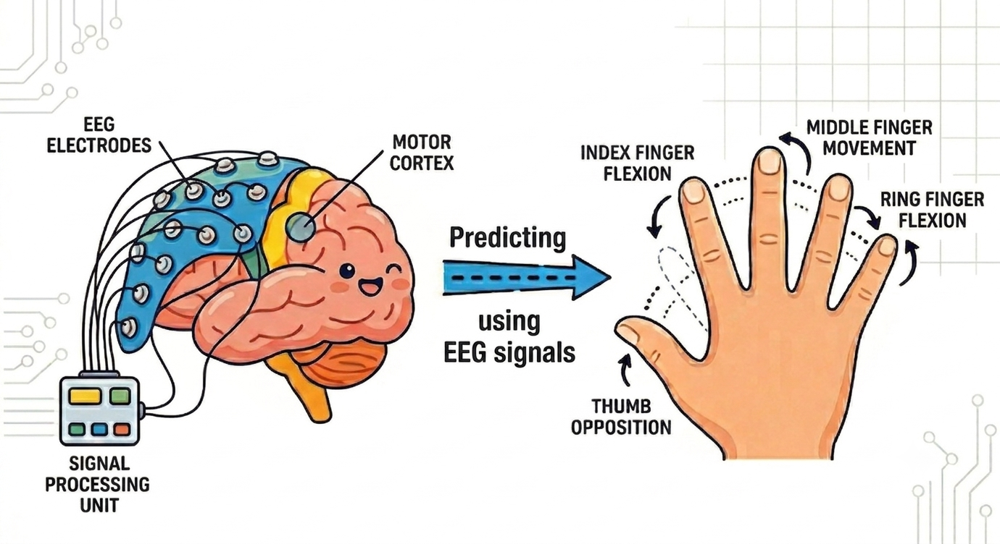
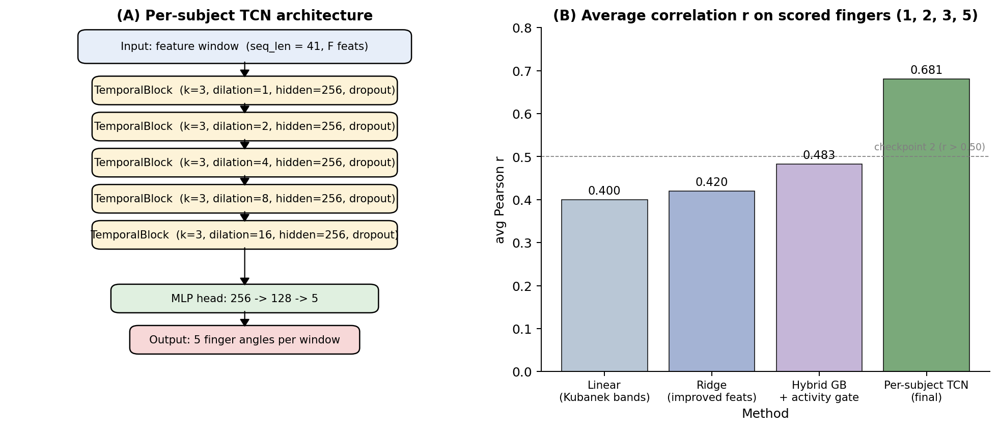
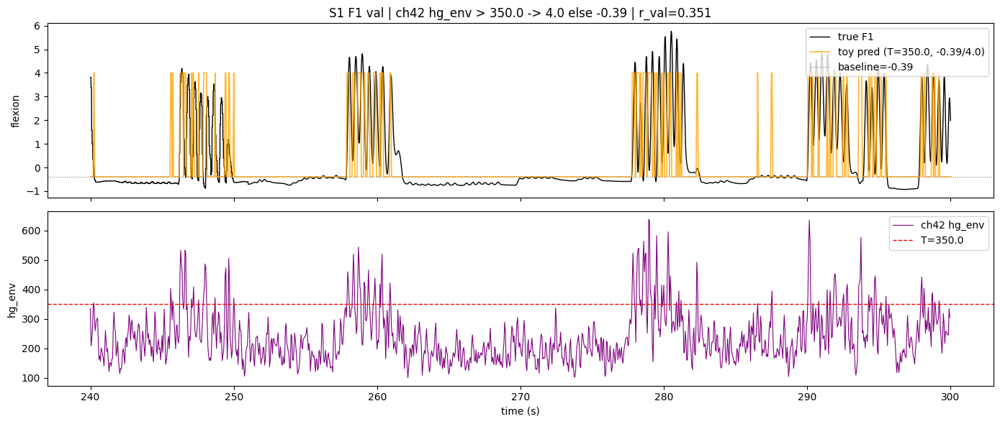

# Decoding Hand Movement from ECoG

**Predicting continuous five-finger hand movement from intracranial brain signals (ECoG) with per-subject Temporal Convolutional Networks — leaderboard correlation _r_ ≈ 0.68.**



This project decodes how a person's fingers are moving, moment to moment, directly from electrocorticography (ECoG) — electrodes resting on the cortical surface. Given ~62–64 channels of raw 1 kHz brain signal, the model reconstructs the continuous flexion of all five fingers. It was the final project for **BE 5210 (Brain–Computer Interfaces) at the University of Pennsylvania**.

---

## TL;DR

- **Task:** regress continuous 5-finger flexion from raw ECoG, for 3 human subjects (62 / 48 / 64 electrodes, 1 kHz).
- **Result:** **_r_ ≈ 0.6808** mean correlation on the held-out competition leaderboard — up from ~0.40 for a strong linear baseline.
- **Model:** a **per-subject Temporal Convolutional Network (TCN)** — a stack of causal, dilated 1-D convolutions — on hand-crafted spectral features.
- **Key insight:** the win came from *architecture*, not more features. Exponentially dilated causal convolutions buy ~6 seconds of strictly-causal temporal context essentially for free in depth, which a linear/ridge decoder fundamentally cannot capture. Per-subject models beat any shared model because channel counts and neural responses differ across subjects.

> 📄 **Full methods, results, and the approaches we tried and dropped:** see the **[technical writeup](docs/TECHNICAL_WRITEUP.md)**.

---

## Results

Mean Pearson correlation on the competition-scored fingers (1, 2, 3, 5), best result per method:

| Approach | Leaderboard _r_ |
|---|:---:|
| Linear decoder (Kubanek-style bands) | 0.40 |
| Ridge regression (improved features) | 0.42 |
| Gradient-boosting + activity gate (*side story*) | 0.483 |
| **Per-subject TCN (final)** | **0.681** |



The TCN's internal 80/20 validation correlations were 0.50 / 0.57 / 0.71 for subjects 1 / 2 / 3 — subject 2 is structurally the hardest (lower SNR). See [`notebooks/tcn_finger_decoder.ipynb`](notebooks/tcn_finger_decoder.ipynb).

---

## The decoder

```
Raw ECoG (1 kHz, C channels)
  → Common-average reference
  → Notch filters @ 60 / 120 / 180 Hz
  → Bandpass 0.15–200 Hz (zero-phase)
  → Sliding windows (100 ms / 50 ms overlap → 20 Hz feature rate)
  → 10 features/channel: mean, variance, line-length,
       6-band RMS power, high-gamma (70–200 Hz) Hilbert envelope
  → Standardize → sequences of 41 windows (~2 s context)
  → Per-subject TCN: 5 dilated TemporalBlocks (dilations 1,2,4,8,16),
       kernel 3, hidden 256, residual connections → MLP head (256→128→5)
  → Linear interpolation back to 1 kHz
  → Savitzky–Golay + boxcar smoothing → predicted finger flexion
```

Full walkthrough with code and plots: [`notebooks/tcn_finger_decoder.ipynb`](notebooks/tcn_finger_decoder.ipynb).

### Why a TCN

Two constraints drove the choice. We needed a model that could see far enough into the past to capture motor-planning context (hundreds of ms to seconds) while remaining **strictly causal** — it must never peek at future glove samples. And we wanted that context cheaply, because each subject's training set is small. A TCN with exponentially dilated kernels gives both: five dilated blocks (dilations 1→16) cover a receptive field of ~125 feature windows (~6 s) at fixed depth, while causal padding plus `Chomp1d` truncation guarantee no leakage from the future. Linear and ridge decoders plateaued near _r_ ≈ 0.40–0.42 even after adding a high-gamma Hilbert envelope and per-finger regularization sweeps — an inner product of features cannot capture the non-linear, delayed coupling between frequency bands and movement.

---

## Side story: the activity-gated hybrid

Before the TCN, the strongest non-neural-network pipeline was a **two-stage gated decoder**: an activity detector predicts *whether* a finger is moving, and a gradient-boosted / ridge amplitude model predicts *how much*, with the two multiplied together and lightly smoothed. It reached _r_ ≈ 0.483 on the leaderboard and was notably accurate on **subject 1's thumb**, where a single high-gamma channel carries a clean movement signal.

We didn't ship it as the headline: the activity gate was brittle on the hardest subject and needed several per-subject fall-backs, signalling overfitting to a heuristic rather than a robust method. But it surfaced a genuinely useful finding — *gating amplitude by movement onset helps the thumb specifically* — which is why it stays part of the story. The full details are in the [technical writeup](docs/TECHNICAL_WRITEUP.md#8-approaches-we-explored-and-abandoned).



*Thresholding one high-gamma channel (ch42) as a thumb activity detector: when its envelope (bottom) crosses 350 it tracks the timing of subject 1's thumb flexion (top) — r ≈ 0.35 from a single channel. This is the observation that motivated gating amplitude by movement onset.*

---

## Tech stack

`PyTorch` (TCN) · `scikit-learn` (ridge, gradient boosting, scaling) · `NumPy` / `SciPy` (signal processing: Butterworth/notch filtering, Hilbert envelope, Savitzky–Golay smoothing) · `Matplotlib`.

## Repository guide

| Path | What it is |
|---|---|
| [`notebooks/tcn_finger_decoder.ipynb`](notebooks/tcn_finger_decoder.ipynb) | **Main showcase** — full per-subject TCN pipeline, training, and leaderboard prediction. |
| [`docs/TECHNICAL_WRITEUP.md`](docs/TECHNICAL_WRITEUP.md) | Deep dive: methods, feature design, architecture, and the full set of approaches we explored and abandoned (including the activity-gated hybrid). |
| [`data/README.md`](data/README.md) | Dataset description and expected layout (the data itself is not redistributed). |
| `figures/` | Figures used in this README. |

## Dataset

The data is **not included in this repository** — it is course-provided material and not ours to redistribute. See [`data/README.md`](data/README.md) for a full description and the file layout the notebooks expect. In brief: paired ECoG + dataglove recordings from three human epilepsy patients (62 / 48 / 64 electrodes, sampled at 1 kHz), with continuous five-finger flexion as the prediction target, following the BCI Competition IV / Kubanek et al. (2009) finger-flexion paradigm.

## Authors & acknowledgements

Built by **Nandagopal Vidhu**, **Qingyuan Shi**, and **Samir Patki** (team *Talk to the Hand*) as the final project for **BE 5210 (Brain–Computer Interfaces)** at the University of Pennsylvania, Spring 2026. Thanks to the course staff for the dataset and the competition framework.

## License

Code and notebooks are released under the [MIT License](LICENSE).
